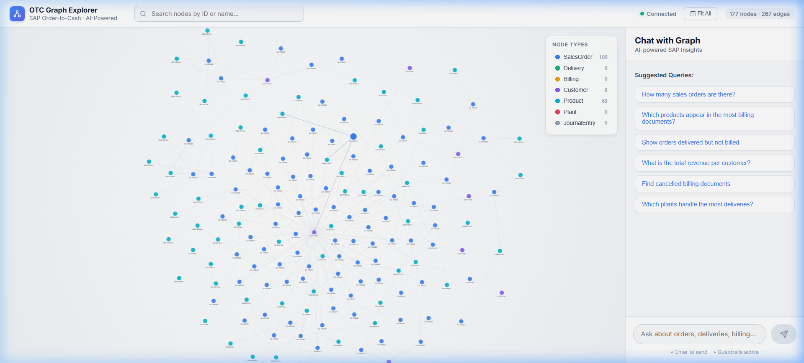
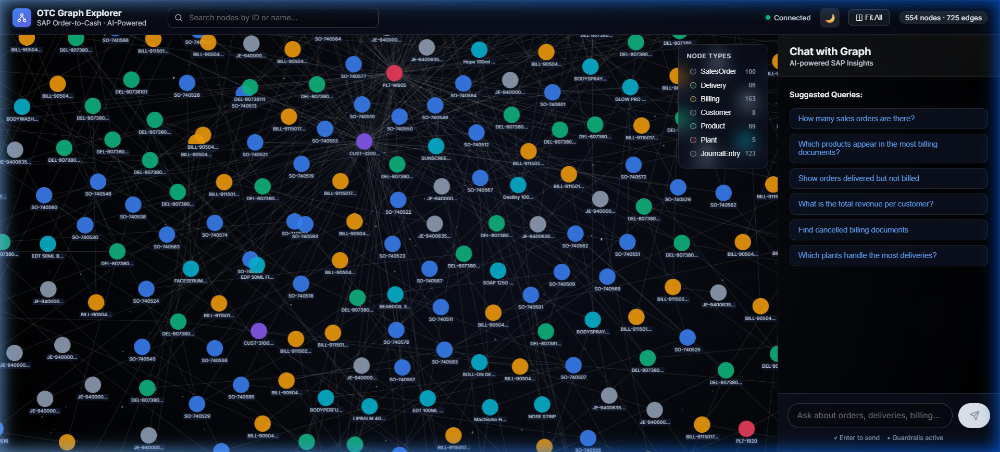
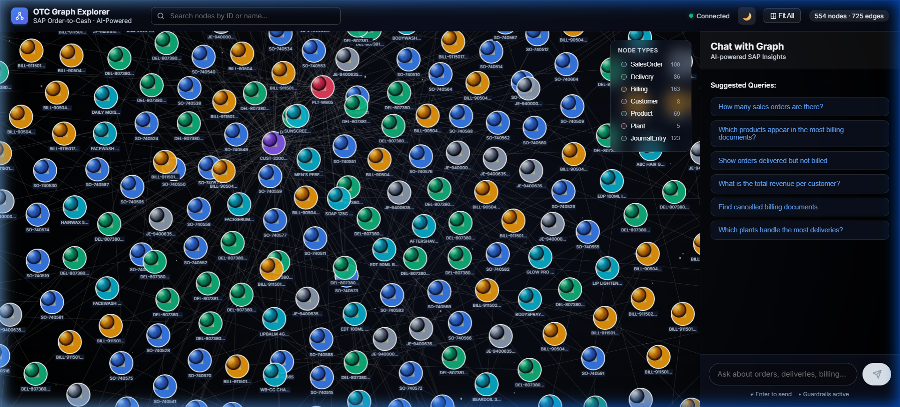
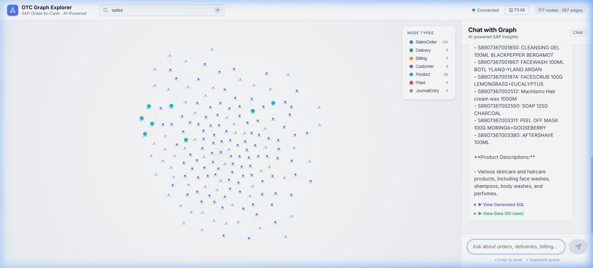

# 🌌 Enterprise Graph Intelligence System (SAP OTC)

## 📖 Project Overview
The **Graph Intelligence System** is a full-stack, AI-powered application designed to visualize, search, and interrogate complex enterprise data. Specifically built around the **SAP Order-to-Cash (O2C)** process, it transforms raw relational data (sales orders, deliveries, invoices, journal entries) into a beautiful, interactive graph network. 

Beyond just visualizing data, the system features a **Conversational NLP Agent** that allows users to ask natural language questions (e.g., *"Which products appear in the highest billing documents?"*) and instantly receive intelligent text answers, raw data insights, and dynamic graph highlights based on autonomous SQL generation.

The project is split into two tightly coupled layers: a high-performance **Python/FastAPI Backend** and a highly aesthetic **React/Cytoscape.js Frontend** featuring a dual-theme UI (Light Mode & Immersive 3D Space Mode).

## 🚀 Live Demo Recording

---

## ⚙️ Backend Architecture (Python & FastAPI)
The backend acts as the data ingestion engine, graph topology builder, and the AI brain.

### `main.py`
The nervous system of the backend. It spins up the **FastAPI** server and handles CORS so the frontend can securely communicate with it. It exposes local API endpoints (`/api/graph`, `/api/chat`, `/api/stats`, `/api/node/{id}`) and controls the startup lifecycle of the SQLite database and LLM connections.

### `database.py` & `ingest.py`
- **`database.py`**: Handles strict SQLite connection pooling and schema creation for all 18 SAP data tables (e.g., `sales_order_headers`, `billing_document_items`).
- **`ingest.py`**: The ET (Extract-Transform) layer. It aggressively scans the root dataset directory, reads through complex `.csv` and `.jsonl` files mapping millions of rows, normalizes the data, and securely stages it inside a local `otc.db` SQLite file.

### `graph.py`
The "Topology Engine." Instead of sending raw SQL tables to the React frontend, it converts the relational SAP data into an interconnected network composed of **Nodes** and **Edges**. It maps primary keys to endpoints (e.g., Sales Order 145 ➔ Delivery 88) and formats them into a schema universally understood by graph visualization libraries.

### `llm.py`
The AI wrapper. It initializes our connection strictly utilizing **Google Gemini 1.5 Flash** with a seamless failover to **Groq**. This guarantees ultra-low latency inference times when evaluating enterprise data queries.

### `sql_agent.py`
The "AI Brain." When a user asks a question, this file handles the logic:
1. **JSON Intent Mapping**: It parses the chat and classifies the intent (Aggregation, Flow Tracing, Anomaly Detection).
2. **Zero-Hallucination SQL**: It autonomously writes raw SQLite code matching your exact schema structure based on the user's natural language.
3. **Pre-Flight Validation**: It runs an `EXPLAIN QUERY PLAN` on the generated SQL to guarantee the query is logically sound before executing it, forcing the AI to self-correct if it makes a mistake.
4. **Natural Execution**: It returns the actual SQL rows, highlights the specific nodes on the client graph, and writes a human-friendly answer.

### `guardrails.py`
The Security Bouncer. Uses Keyword detection and rapid LLM classification to guarantee the chatbot **only** answers questions directly related to SAP Supply Chain data—rejecting attempts to ask about unrelated or general knowledge topics.

---

## 🎨 Frontend Architecture (React.js & Cytoscape.js)
The frontend is a dual-theme graphical explorer built with **React**, **Vite**, and **TailwindCSS**, rendering thousands of nodes securely without lag.

### Dual Theme System (Light & Space Mode)
Seamlessly swap between a clean minimal SaaS layout and an immersive, dark animated visualization.

#### ☀️ Light Mode

*Light Mode: Breathable bubble-like layout (`cose-bilkent` physics). Soft background gradient (`#ffffff` to `#f1f5f9`). Sleek Chat UI with SaaS cards and rounded pills.*

#### 🌌 Space Mode

*Space Mode: Features a dark radial vignette background, animated parallax stars, glowing realistic 3D planet nodes, translucent orbit edges, and premium dark glassmorphism chat panels with frosted blurs.*

#### Realistic SVG Planets

*Zoomed in view of the 3D-generated SVG planets. Each node type features unique radial light sources, deep atmospheric inner shadows, and turbulent cloud/surface textures. The planets feature a subtle floating 'alive' jitter animation to complete the immersive space vibe.*

### Interactive Query Highlights

*Targeted query results (e.g. "show products") instantly map onto the graph by scaling relevant teal nodes up and fading out all unrelated topological structures.*

### `App.jsx`
The state orchestrator. It wraps the entire dashboard, separating the screen into the central Graph rendering zone and the interactive Sidebar elements. It also manages the global state for the active theme (`light` vs `space`) and intercepts real-time theme toggles.

### `GraphView.jsx` (Cytoscape Core)
The absolute core of the visual rendering layer. Highly optimized, it parses the node/edge layout sent by the backend.
- **Interactions**: Allows users to zoom, pan, hover (triggering floating tooltip cards and glassmorphism UI glow), and click (auto-focusing on the node and fading out unrelated network topologies).

### `ChatPanel.jsx` & `NodeDetail.jsx`
- **ChatPanel**: A beautifully styled, chat-like sliding sidebar. It leverages CSS glassmorphism and maintains deep context memory arrays passing historical state down into `sql_agent.py`. It provides collapsable viewers for `Raw SQL` and `Extracted JSON Data`.
- **NodeDetail**: A reactive sidebar component exposing absolute business metadata bounds behind discrete clicked SVG nodes.

### `SearchBar.jsx` & `Starfield.jsx`
- **`SearchBar`**: A rapid-lookup input field positioned at the app header to immediately query any object ID globally.
- **`Starfield.jsx`**: A lightweight procedural animation component specifically triggered in Space Mode to generate hundreds of slowly drifting, parallax-scrolling stars using pure CSS drop-shadows—securing a 60-FPS animated background natively without heavy video files.

### `api/client.js`
The networking layer utilizing Vite Environment hooks (`import.meta.env.VITE_API_URL`). It acts as a router, flawlessly capturing local dev server requests while dynamically rewriting headers to hit deployed Render cloud endpoints in production.

---

## 🌎 Deployment Status
1. **Frontend**: The React application runs flawlessly on **Vercel** configured via the injected `$VITE_API_URL`.
2. **Backend**: The autonomous FastAPI agent engine is hosted on **Render**, locked securely against a defined `3.11.0` `.python-version` runtime build template.
